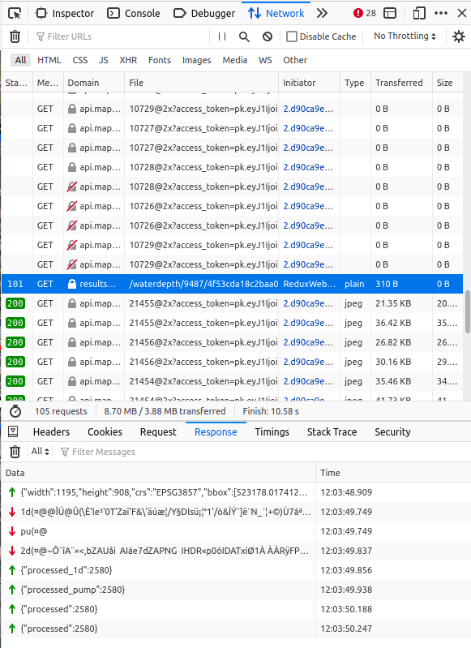

# QUESTIONS

## How do I retrieve the 1d data of water flowing through pipes? (The data that shows in the livestite as moving dots)  

This data arrives over the same websocket as the waterdepth image.
This websocket url would look similar to this:
wss://results06.staging.3di.live/waterdepth/9487/4f53cda18c2baa0c/?signature=4138f8d8b78201521fe3101f4514fa2be6d1ca2fd75246521298b8564149d4ed

The difference between the waterdepth image and the pipes flowing water is that waterdepth is "2d" and the pipes moving dots is "1d".
In the "Network" tab of the browser developer console you can see that some incoming messages for the websocket: 

- 2d messages for the waterdepth raster 
- 1d messages for the waterflow through pipes and channels

  
Screenshot from Firefox showing the 1d and 2d incoming websocket data/messages.  

In the example code in "./dist/index.html" you can also see that the code checks for the 2d type in the following line:  
"if (typeText === '2d') {"  

It is possible to add a check for "1d" here as well. 

But the data coming in over the websocket is only the flow direction speed and amount of the water per pipe.  
This data does not contain information about were the pipe is located on the map (lat lng).  
Information about were the pipes and channels (and other vector data) is located (lat lng) can be retrieved from the GeoJSON file belonging to the Model.  
This can be retrieved by the url returned from this api call:  
https://api.staging.3di.live/v3.0/threedimodels/<model_id>/geojson/all/download/  