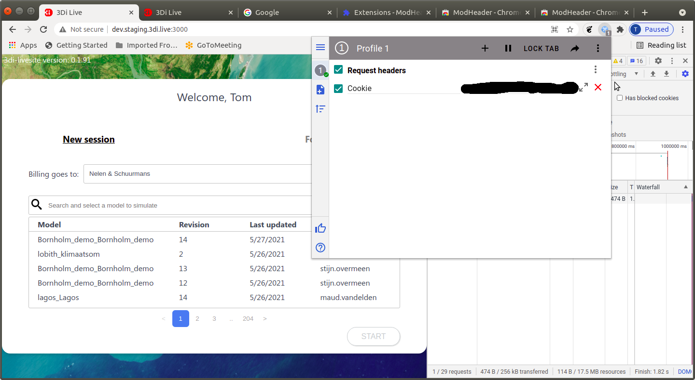

# 3di_starterkit
This starterkit can be used as an example on how to **setup the waterdepth websocket** of the [3di API](https://api.3di.live/v3.0/) to **follow an existing simulation**.  

The code in `/dist/index.html` is a working example in simple form.  

It is best to see the code in action by following below installation.

## !important do before installation! Proxy on Chrome browser  
On Chrome there is the problem that auth cookies are not send to the api.  
https://github.com/nens/threedi-live-site/issues/906  
We are unsure if this problem will sooner or later also apply to firefox (because it is a new standard?) or if this is a chrome specific bug. We expect this problem is currently also in Firefox and other browsers.  
This readme only has a fix for Chrome browser, but probably similar plugins exist for other browsers.  

Use the Modheader chrome plugin to fix this problem.  
https://chrome.google.com/webstore/detail/modheader/idgpnmonknjnojddfkpgkljpfnnfcklj  
! IMPORTANT ! 
Via "manage extensions" give the chrome plugin only acces to specific sites:  
- http://dev.staging.3di.live  
- http://dev.beta.3di.live  
- http://dev.3di.live  
- http://dev.3di.tw  

Now for example when you want to use https://staging.3di.live as a backend during dev do as follows:  

- Login at https://staging.3di.live
- Copy to your clipboard the value of the 'cookie' from the request header in the '/profile' api call from https://staging.3di.live.
- Now go to http://dev.staging.3di.live:3000  
(if yout redirected too fast, try temporarily disabling javascript or pausing in the debugger)   
- Open the 'Modheader plugin and add a item to the 'Request headers':  
key: Cookie, value: paste from your clipboard

Now you should be able to use development with Chrome browser.  

## Installation

1. Clone this repo: 

   `$ git clone https://github.com/nens/3di_starterkit.git `  

2. Move into the repo:

   `$ cd 3di_starterkit`

3. Install the NPM dependencies.    
   `$ npm install`  

4. To send file requests to your localhost change the /etc/hosts file of your operating system.

   Add the following lines to your /etc/hosts file:

   `127.0.0.1 dev.3di.live`

   `127.0.0.1 dev.3di.tw`

   `127.0.0.1 dev.staging.3di.live`

   `127.0.0.1 dev.beta.3di.live`

   - On ubuntu the /etc/hosts file can be edited by doing:

     `$ sudo gedit /etc/hosts`

   - On Windows 10 the /etc/hosts file is located at the following location:

     `c:\Windows\System32\Drivers\etc\hosts`

     You need admin rights to edit it with Notepad.  

5. Now in the repository run:

   `$ npm start`

6. Go to one of the following urls. Choose the url that looks like the base url of your 3di-livesite prefixed with ".dev":

   [http://dev.3di.live:3000](http://dev.3di.live:3000)

   [http://dev.3di.tw:3000](http://dev.3di.tw:3000)

   [http://dev.staging.3di.live:3000](http://dev.staging.3di.live:3000)
   
   [http://dev.beta.3di.live:3000](http://dev.beta.3di.live:3000)

7. The webpage that opens allows you to fill in a "simulation_ID" and connect a waterdepth websocket to it.

   The easiest way to proceed is to: 

   - start a new simulation via the 3di-livesite
   - Add rain to see the waterdepth layer in action. For example 300mm  1hour of rain.
   - Play the simulation.
   - You can obtain the simulation_ID by hovering your mouse over the title/header.
   - Now go back to the webpage and fill out the simulation_ID and click the button "start connecting websocket".
   - The waterdepth image should start animating shortly in the image below the button.

## Code explanation

The code in /dist/index.html is setup very minimal.  

You can find comments within the code about which line does which.    

It is intended to help developers setup their own 3di-solution.  

Currently the only example here is to setup the websocket for waterdepth.  

## More resources

- More information on the [3di API](https://api.3di.live/v3.0/)  can also be found in the [3di-swagger-docs](https://api.3di.live/v3.0/swagger) or in the [3di-docs](https://docs.3di.live/).  

- Another good way to see the 3di-API in action is also through the [3di-livesite](https://3di.live/).  

  When opening the developer-console "Network" tab in your browser it is possible to follow the content of each API call.  

- Are you planning to create your own JavaScript solution for 3di ?  

  If you decide to use [TypeScript](https://www.typescriptlang.org/) then it is possible to use our generated type-definitions from [here](https://github.com/nens/threedi-api-openapi-client) (currently only available for employees of Nelen & Schuurmans).  

## Help

Need help with running this example code?  

Or maybe you like to see more examples? For instance adding rain or showing waterflow in pipes?  

Employees, Customers and partners may create a support ticket [here](https://nelen-schuurmans.topdesk.net/).

Employees may also make a github issue [here](https://github.com/nens/3di_starterkit/issues).

Frequently asked questions can be found [here](./QUESTIONS.md)
